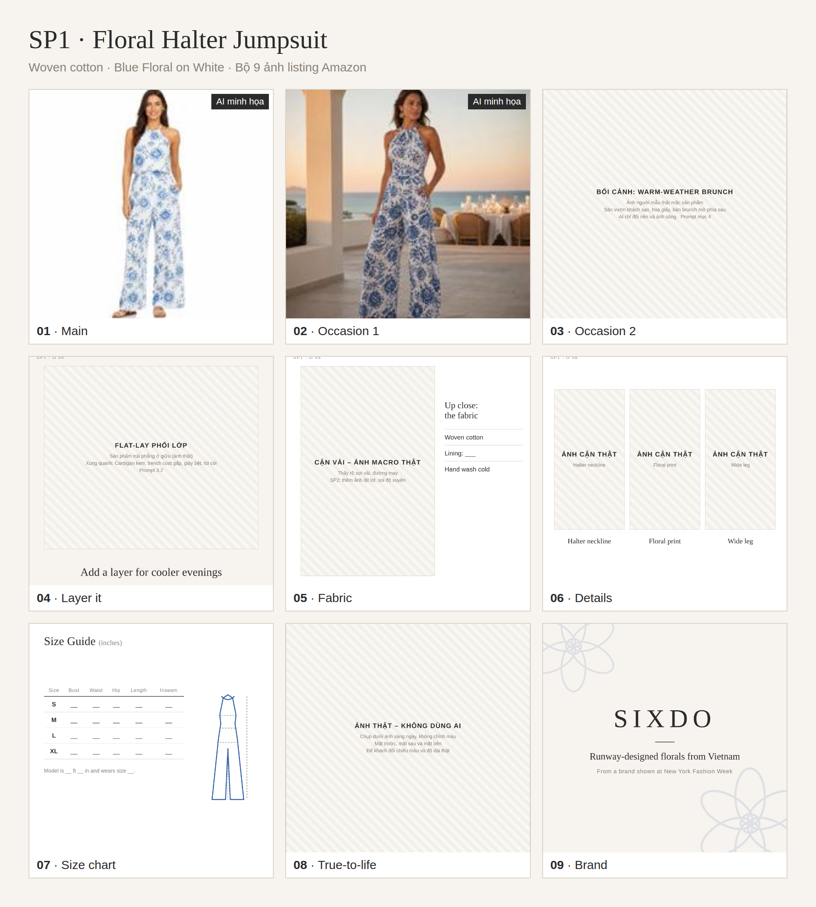
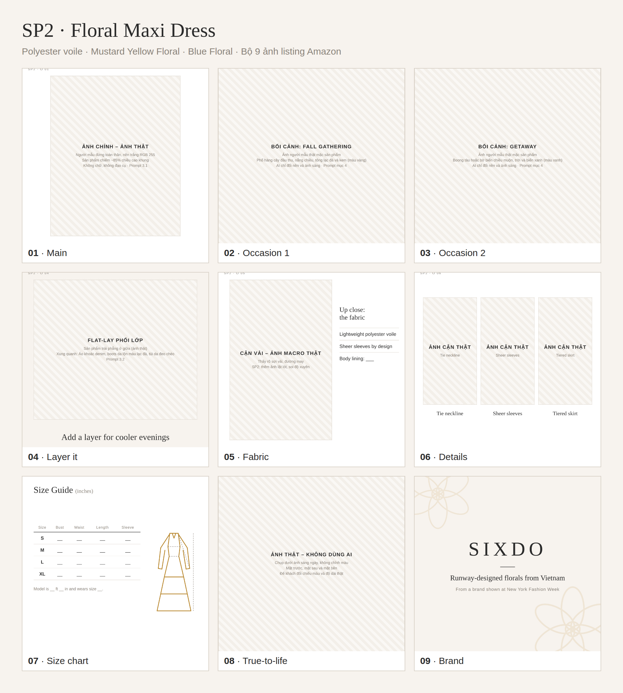
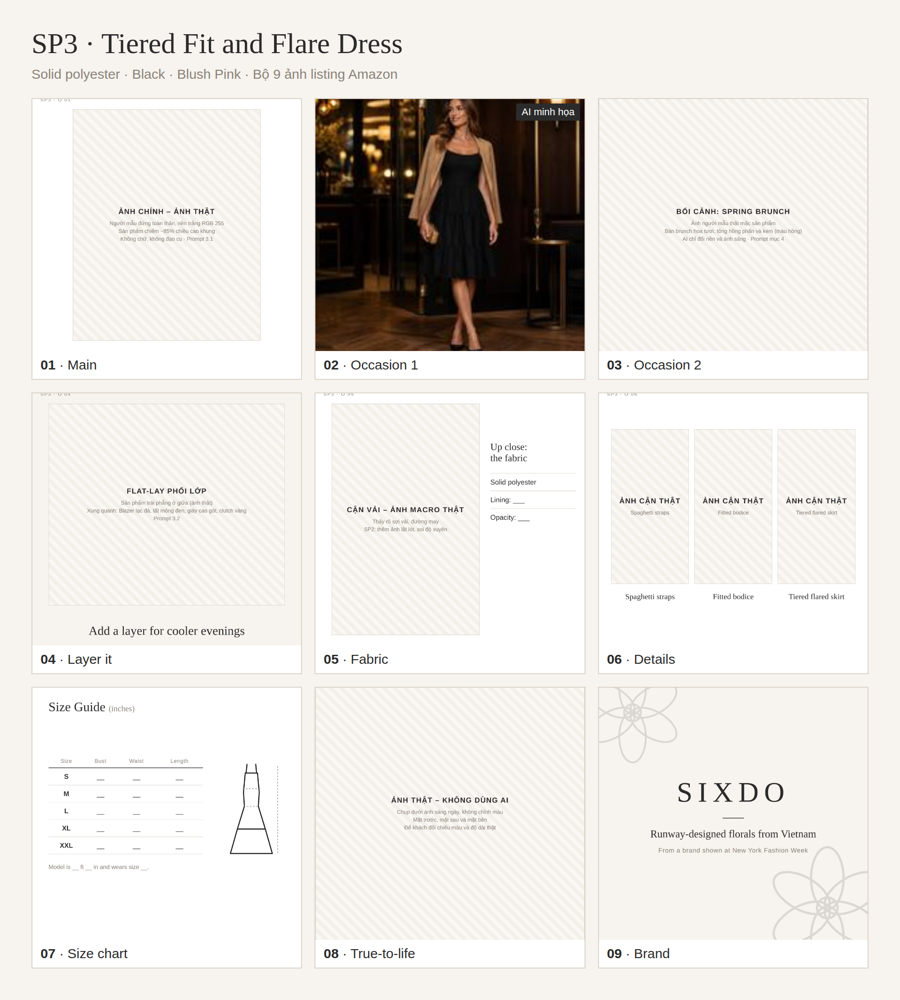

# Bộ 9 hình ảnh chuẩn Amazon cho 3 sản phẩm SIXDO
Yêu cầu 05 – Hình ảnh listing có sử dụng AI
3 bộ × 9 ảnh, 2000×2000 px  |  Bám theo Yêu cầu 02 (listing) và Yêu cầu 03 (moodboard, styling)

### Kết luận chính
Mỗi sản phẩm có một bộ 9 ảnh theo cùng một khung. Bộ ảnh đi theo thứ tự khách cần:
- Thấy món đồ (ô 1).
- Thấy nó hợp dịp nào (ô 2–4).
- Tin vào chất liệu và chi tiết (ô 5–6).
- Chọn đúng size (ô 7).
- Đối chiếu hàng thật (ô 8).
- Tin thương hiệu (ô 9).

Bộ ảnh nhắm vào đúng vấn đề của Phần 1–2:
- 5/8 review SP2 lệch kỳ vọng về hình ảnh.
- Trong review đối thủ, 32/40 nhắc chất liệu và 30/40 nhắc size.

Nguyên tắc AI: **AI chỉ đổi nền, ánh sáng và đồ phối xung quanh; sản phẩm và người mẫu phải từ ảnh thật.** Ảnh AI không được làm sai họa tiết, màu, độ dài hay độ xuyên.

Những gì đã có trong bài nộp:
- **Đồ họa hoàn chỉnh:**
  - Ô 9 (thương hiệu).
  - Khung và chữ của ô 4, 5, 6.
  - Size chart ô 7, chỉ còn chờ điền số đo.
- **Ảnh AI minh họa:** 3 ảnh bối cảnh, để thấy hướng hình ảnh.
- **Khung chờ ảnh thật:** các ô còn lại, mỗi khung ghi rõ yêu cầu chụp.
- **Bộ prompt ChatGPT:** để thay khung bằng ảnh thành phẩm.

Chưa có ảnh sản phẩm thật, vì trang Amazon bị chặn trong môi trường làm bài. Vì vậy các ô dùng ảnh thật đang là khung chờ.

## 1 Quy định áp dụng
- **Ảnh chính (ô 1)** [1]:
  - Nền trắng thuần, không chữ, không đạo cụ.
  - Sản phẩm chiếm khoảng 85% khung hình.
  - Đồ người lớn chụp trên người mẫu đứng.
- **Kích thước:** tối thiểu 1000 px để phóng to được; bộ này làm 2000×2000 px.
- **Ảnh phụ (ô 2–9):** được có chữ, đồ họa và bối cảnh. Chữ ngắn, đúng chính tả, không nhắc giá hay khuyến mãi.
- **Ảnh có người do AI tạo:** từ 07/2026 phải gắn nhãn [KC]. Vì vậy người mẫu phải là người thật; AI chỉ dựng nền.
- **Thương hiệu:** chỉ nói "From a brand shown at New York Fashion Week", không nói mẫu này từng lên sàn diễn.

## 2 Khung 9 ô
| Ô | Nội dung | Mục đích | Trụ thông điệp (YC03) | Làm bằng |
|---|---|---|---|---|
| 1 Main | Người mẫu đứng toàn thân, nền trắng | Được bấm (CTR) | – | Ảnh thật, chỉ tách nền |
| 2 Occasion 1 | Bối cảnh theo dịp chính | Thấy hợp dịp | Dịp cụ thể / Chuyến đi | Ảnh thật + nền AI |
| 3 Occasion 2 | Bối cảnh theo dịp phụ | Thấy dùng được nhiều dịp | Phối nhiều bối cảnh | Ảnh thật + nền AI |
| 4 Layer it | Flat-lay phối lớp, chữ "Add a layer for cooler evenings" | Thấy mặc được trong mùa lạnh | Phối nhiều bối cảnh | Ảnh trải phẳng thật + đồ phối AI |
| 5 Fabric | Cận vải, chú thích chất liệu, lót, độ xuyên | Giảm hoàn hàng vì chất liệu | Niềm tin | Ảnh macro thật + chú thích |
| 6 Details | 3 ảnh cận chi tiết thiết kế | Thấy đáng tiền | Niềm tin | Ảnh cận thật + nhãn |
| 7 Size chart | Bảng inch, hình dáng, người mẫu mặc size gì | Giảm hoàn hàng vì size | Niềm tin | Đồ họa |
| 8 True-to-life | Ảnh ánh sáng ngày, không chỉnh; trước, sau, bên | Đối chiếu màu và độ dài | Niềm tin | Ảnh thật, không AI |
| 9 Brand | SIXDO, "Runway-designed florals from Vietnam" | Tin thương hiệu | – | Đồ họa |

## 3 Bộ ảnh từng sản phẩm

### 3.1 SP1 – Floral Halter Jumpsuit
Hai bối cảnh:
- Ô 2 Resort dinner: sân resort lúc hoàng hôn.
- Ô 3 Warm-weather brunch: sân vườn khách sạn.

Ô 4 phối cardigan kem, trench coat, giày bệt. Ô 6 gồm cổ yếm, họa tiết, ống rộng.

### 3.2 SP2 – Floral Maxi Dress
Hai bối cảnh:
- Ô 2 Fall gathering (màu vàng, tháng 10–11).
- Ô 3 Getaway (màu xanh, tháng 1–2).

Ô 4 phối áo khoác denim và boots da lộn. Ô 5 bắt buộc có ảnh lật lót và soi độ xuyên của tay voan, vì đây là điểm review SP2 phàn nàn.

### 3.3 SP3 – Tiered Fit and Flare Dress
Hai bối cảnh:
- Ô 2 Evening party (màu đen, tháng 11–12).
- Ô 3 Spring brunch (màu hồng, tháng 2–3).

Mỗi màu có ảnh chính riêng. Ô 4 phối blazer lạc đà và tất mỏng. Không ghi "mini/midi" khi chưa đo chiều dài.

## 4 Quy trình sản xuất
| Bước | Việc | Công cụ | Hạn |
|---|---|---|---|
| 1 | Chụp ảnh thật cho mỗi màu: người mẫu đứng toàn thân (trước, sau, bên), ảnh trải phẳng, ảnh macro vải và lót, 3 ảnh cận chi tiết | Điện thoại, ánh sáng ngày | 03/10 |
| 2 | Đo số đo inch từng size, điền vào ô 7 | Thước dây | 03/10 |
| 3 | Tách nền trắng cho ô 1 | Photoroom hoặc ChatGPT (prompt 3.1) | 05/10 |
| 4 | Tạo bối cảnh ô 2–4: dán khối quy tắc, khối sản phẩm và prompt tương ứng | ChatGPT (bộ prompt kèm theo) | 07/10 |
| 5 | Ghép ảnh thật vào khung ô 4–6; kiểm tra chữ | Canva | 08/10 |
| 6 | Kiểm tra từng ảnh theo checklist, rồi tải lên listing | Seller Central | 10/10 |

Checklist kiểm tra (chi tiết trong bộ prompt, mục 7):
- Họa tiết và màu khớp ảnh gốc.
- Dáng, độ dài và độ xuyên đúng như hàng thật.
- Người mẫu tự nhiên.
- Chữ đúng chính tả.
- Ảnh đạt ≥ 1000 px.

Ảnh không đạt một dòng nào thì làm lại hoặc dùng ảnh thật.

## 5 Trạng thái và việc còn lại
| Hạng mục | Trạng thái |
|---|---|
| Khung 9 ô, 27 ảnh 2000×2000 px, 3 bảng tổng hợp | Xong |
| Ô 9 thương hiệu; chữ của ô 4, 5, 6 | Xong, dùng được |
| Ô 7 size chart | Xong khung; chờ số đo thật |
| Ảnh AI minh họa: SP1 ô 1–2, SP3 ô 2 | Xong, chỉ để minh họa hướng bối cảnh; bản đầy đủ nằm trên Canva |
| Ô 1, 2, 3, 8 và phần ảnh của ô 4, 5, 6 | Chờ ảnh thật, sau đó chạy prompt ChatGPT |

Ảnh AI minh họa (độ phân giải đầy đủ trên Canva):
- SP1 ô 1: https://www.canva.com/M/MAHWsE_0AEg
- SP1 ô 2: https://www.canva.com/M/MAHWsLlZqWE
- SP3 ô 2: https://www.canva.com/M/MAHWr5nt5qo

## Nguồn
[N1] SIXDO – Phần 1–2: mã hóa review SIXDO và đối thủ.
[N2] SIXDO – Yêu cầu 02 và Yêu cầu 03: title, lịch bán, moodboard, styling guide.
[N3] Bộ prompt ChatGPT tạo hình ảnh (`yeu-cau-06/SIXDO_Prompt_HinhAnh_ChatGPT`).
[1] Amazon Fashion Imaging Guidelines: https://m.media-amazon.com/images/G/01/SPIS/Fashion_Apparel_Imaging_Guidelines_Spring_2021.pdf
