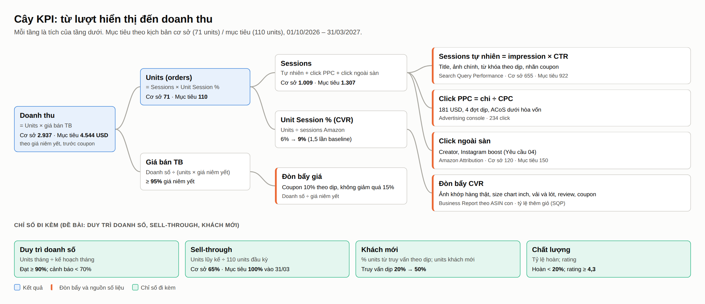
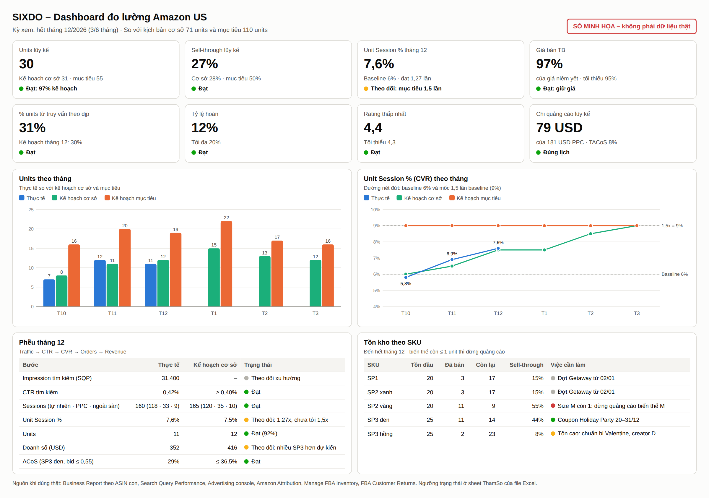

# Hệ thống đo lường cho SIXDO trên Amazon US
Yêu cầu 06 – Measurement System
Traffic → CTR → CVR → Orders → Revenue; duy trì doanh số, sell-through, khách mới  |  01/10/2026 – 31/03/2027

### Kết luận chính
Hệ thống đo lường trả lời 3 câu hỏi mỗi tháng:
- Có bán đủ số units theo kế hoạch không?
- Nếu thiếu, thiếu ở bước nào của phễu?
- Làm gì tiếp theo?

Thành phần của hệ thống:
- **Một công thức gốc:** Units = Sessions × Unit Session %. Sessions tách theo 3 nguồn (tự nhiên, PPC, ngoài sàn) để không đếm trùng.
- **Cây KPI 4 tầng:** doanh thu → units và giá bán → sessions và CVR → các đòn bẩy. Mỗi tầng có nguồn số liệu trong Seller Central và mục tiêu cụ thể.
- **Kế hoạch theo tháng** tính từ tham số Yêu cầu 02:
  - Cơ sở: 71 units, sell-through 65%, CVR tăng dần từ 6% lên 9%.
  - Mục tiêu: 110 units, sell-through 100%, CVR 9% cả kỳ.
- **Dashboard mẫu** là file Excel có công thức (`SIXDO_YeuCau06_Dashboard.xlsx`). Mỗi tháng chỉ cần điền số từ 6 báo cáo; chỉ số, trạng thái Đạt / Theo dõi / Cảnh báo và biểu đồ tự cập nhật.
- **Chứng minh uplift CVR 50%:** so sánh Unit Session % cả kỳ với baseline 90 ngày trước 01/10. Kèm một ASIN đối chứng và các chỉ báo sớm, vì lượng traffic quá nhỏ để kiểm định thống kê trên từng listing.

Nhãn: [XN] đã xác nhận · [GĐ] giả định · [KC] cần kiểm chứng. Mọi mục tiêu là giả định cho tới khi có baseline thật (Yêu cầu 02, Phụ lục B).

## 1 Nguyên tắc đo
| Nguyên tắc | Cách làm | Lý do |
|---|---|---|
| Một định nghĩa cho mỗi chỉ số | Units = units ordered (Business Report). CVR = Unit Session % theo ASIN con. Doanh thu = Ordered product sales | Tránh mỗi báo cáo một con số |
| Không đếm trùng traffic | Sessions tự nhiên = tổng sessions − click PPC − click ngoài sàn (Amazon Attribution) | Biết chính xác phần tăng đến từ đâu |
| Có baseline trước khi sửa | Lấy Sessions, Unit Session % của 22 ASIN con trong 90 và 28 ngày trước 01/10 | Uplift CVR chỉ có nghĩa khi so với mốc cũ |
| Tách hiệu ứng từng thay đổi | So sánh 14 ngày trước và sau mỗi thay đổi lớn (ảnh, bullet, coupon), đối chiếu một ASIN không đổi | Traffic 1–2 session/ngày quá nhỏ cho A/B test |
| Đo theo tồn kho | Theo dõi units và tồn theo SKU, màu, size | 110 units chia cho 22 biến thể; hết size là mất đơn |

## 2 Cây KPI

| Tầng | Chỉ số | Công thức | Nguồn | Tần suất | Mục tiêu cơ sở / mục tiêu |
|---|---|---|---|---|---|
| Kết quả | Doanh thu | Units × giá bán TB | Business Report | Tuần | 2.937 / 4.544 USD (giá niêm yết) |
| Kết quả | Units | Sessions × Unit Session % | Business Report | Tuần | 71 / 110 |
| Kết quả | Giá bán TB | Doanh số ÷ (units × giá niêm yết) | Business Report | Tháng | ≥ 95% |
| Traffic | Impression tìm kiếm, CTR | Click ÷ impression | Search Query Performance | Tuần | CTR ≥ 0,4% [GĐ], thay bằng CTR tháng 10 |
| Traffic | Sessions tự nhiên | Tổng − PPC − ngoài sàn | Business Report, Advertising console, Attribution | Tuần | 655 / 922 |
| Traffic | Click PPC | Chi ÷ CPC | Advertising console | Ngày | 234 click, 181 USD |
| Traffic | Click ngoài sàn | Theo từng link | Amazon Attribution | Tuần | 120 / 150 |
| Chuyển đổi | Unit Session % | Units ÷ sessions Amazon | Business Report theo ASIN con | Tuần | 6% → 9% / 9% |
| Chuyển đổi | Tỷ lệ thêm giỏ | Thêm giỏ ÷ click | Search Query Performance | Tuần | Tăng sau mỗi thay đổi listing |
| Hiệu quả | ACoS, TACoS | Chi PPC ÷ doanh số PPC; chi PPC ÷ tổng doanh số | Advertising console | Tuần | ACoS dưới hòa vốn B (46,1% SP1/SP2; 36,5% SP3) |

## 3 Nối mục tiêu đề bài với KPI
| Mục tiêu đề bài | KPI chính | KPI đi kèm | Ngưỡng |
|---|---|---|---|
| Kinh doanh: uplift CVR 50% | Unit Session % cả kỳ ÷ baseline | Unit Session % từng tháng; CVR theo SKU | ≥ 1,5 lần baseline (6% → 9%) |
| Marketing: tối ưu hình ảnh, content | CTR tìm kiếm; tỷ lệ thêm giỏ | Tỷ lệ hoàn lý do "not as described"; rating | Hoàn < 20%; rating ≥ 4,3 |
| Truyền thông: tái định vị theo dịp | % units từ truy vấn theo dịp | Số từ khóa dịp có impression; tìm kiếm thương hiệu "sixdo" | 20% (T10) → 50% (T3) |
| Duy trì doanh số | Units tháng ÷ kế hoạch tháng | Units theo tuần | Đạt ≥ 90%; cảnh báo < 70% |
| Sell-through tồn kho | Units lũy kế ÷ 110 | Tồn theo SKU; số tháng còn hàng | Cơ sở 65%, mục tiêu 100% vào 31/03 |
| Khách mới | % units từ truy vấn không chứa tên thương hiệu | Units khách mới (Repeat Purchase Behavior) [KC]; click ngoài sàn | Tăng theo % truy vấn dịp |

**Đo khách mới thế nào:**
- SIXDO còn ít khách quen trên Amazon, nên gần như mọi đơn đều từ khách mới. Chỉ số có ý nghĩa hơn là khách mới đến từ đâu: từ truy vấn theo dịp (không gõ "sixdo") và từ ngoài sàn (Attribution).
- Báo cáo Repeat Purchase Behavior trong Brand Analytics cho biết số khách mua lặp lại. Khách mới = tổng khách − khách lặp lại [KC].

## 4 Kế hoạch theo tháng
Units tháng = (sessions tự nhiên + click PPC) × Unit Session % + click ngoài sàn × 4%.

**Tham số lấy từ Yêu cầu 02:**
- Session tự nhiên và click ngoài sàn theo tháng lấy từ mô hình.
- Click PPC lấy từ lịch 4 đợt quảng cáo.

**Unit Session % ở kịch bản cơ sở tăng dần:**
- Listing mới chỉ xong giữa tháng 10, nên tháng 10 vẫn ở baseline 6%.
- Mức 1,5 lần baseline (9%) đạt vào tháng 3.
- Bình quân cả kỳ khoảng 7,5%, như Yêu cầu 02.

### 4.1 Kịch bản cơ sở (71 units)
| | T10 | T11 | T12 | T1 | T2 | T3 | Cả kỳ |
|---|---|---|---|---|---|---|---|
| Sessions tự nhiên | 95 | 120 | 120 | 115 | 100 | 105 | 655 |
| Click PPC | 33 | 44 | 35 | 69 | 31 | 22 | 234 |
| Click ngoài sàn | 10 | 20 | 10 | 25 | 35 | 20 | 120 |
| Unit Session % | 6,0% | 6,5% | 7,5% | 7,5% | 8,5% | 9,0% | ≈ 7,5% |
| Units | 8 | 11 | 12 | 15 | 13 | 12 | 71 |
| Units lũy kế | 8 | 19 | 31 | 46 | 59 | 71 | |
| Sell-through lũy kế | 7% | 17% | 28% | 42% | 54% | 65% | 65% |
| Doanh số theo giá niêm yết (USD) | 354 | 440 | 415 | 675 | 554 | 499 | 2.937 |
| Chi PPC (USD) | 30 | 30 | 19 | 62 | 28 | 12 | 181 |
| % units từ truy vấn theo dịp | 20% | 25% | 30% | 40% | 45% | 50% | |

### 4.2 Kịch bản mục tiêu (110 units)
| | T10 | T11 | T12 | T1 | T2 | T3 | Cả kỳ |
|---|---|---|---|---|---|---|---|
| Sessions tự nhiên | 134 | 169 | 169 | 162 | 141 | 148 | ≈ 922 |
| Click ngoài sàn | 12 | 25 | 12 | 31 | 45 | 25 | 150 |
| Unit Session % | 9% | 9% | 9% | 9% | 9% | 9% | 9% |
| Units | 16 | 20 | 19 | 22 | 17 | 16 | 110 |
| Units lũy kế | 16 | 36 | 55 | 77 | 94 | 110 | |
| Sell-through lũy kế | 15% | 33% | 50% | 70% | 85% | 100% | 100% |
| Doanh số theo giá niêm yết (USD) | 707 | 801 | 657 | 989 | 725 | 665 | 4.544 |

Click PPC và chi PPC giống kịch bản cơ sở.

Doanh số tính theo giá niêm yết, trước coupon. Doanh thu thực của Yêu cầu 02 là 2.859 USD (cơ sở) và 4.297 USD (mục tiêu), sau coupon và dự phòng hoàn.

## 5 Dashboard mẫu

Ảnh trên dùng **số minh họa** để cho thấy cách đọc dashboard, không phải dữ liệu thật. Ví dụ ở thời điểm hết tháng 12:
- Units lũy kế đạt 97% kế hoạch cơ sở, nên trạng thái là "Đạt".
- CVR mới đạt 1,27 lần baseline, nên là "Theo dõi".
- SP2 vàng hết size M: dừng quảng cáo biến thể đó.
- SP3 hồng tồn cao: chuẩn bị đợt Valentine.

**File Excel `SIXDO_YeuCau06_Dashboard.xlsx`:**

| Sheet | Nội dung | Ai sửa |
|---|---|---|
| HuongDan | Cách dùng, quy ước màu | – |
| ThamSo | Baseline CVR, giá, tồn đầu kỳ theo SKU, ngưỡng cảnh báo | Sửa khi có số thật (01–07/10) |
| KeHoach | Kế hoạch 2 kịch bản theo tháng, có công thức | Sửa ô giả định chữ xanh nếu đổi kế hoạch |
| NhapLieu | 30 dòng (6 tháng × 5 SKU), 14 cột nhập từ 6 báo cáo; có dòng ví dụ | Điền ngày 1–3 mỗi tháng |
| Dashboard | Chọn tháng ở ô C3. Có thẻ tổng hợp lũy kế, 22 chỉ số theo tháng có trạng thái, tồn theo SKU, 2 biểu đồ | Không sửa; chỉ chọn tháng |

Trạng thái tự tính theo ngưỡng ở sheet ThamSo:
- **Units:** Đạt ≥ 90% kế hoạch, Cảnh báo < 70%.
- **CVR:** Đạt ≥ 1,5 lần baseline, Cảnh báo dưới baseline.
- **Giá bán TB:** Đạt ≥ 95%.
- **ACoS:** Đạt ≤ 36,5%, Cảnh báo > 46,1%.
- **Tỷ lệ hoàn:** Cảnh báo > 20%.
- **Rating:** Cảnh báo < 4,3.
- **Tồn theo SKU:** biến thể còn ≤ 1 unit thì báo "Dừng quảng cáo". SKU tồn gấp đôi mức bán còn lại thì báo "Tồn cao" (từ tháng 2).

## 6 Nhịp theo dõi và quy tắc quyết định
| Nhịp | Xem gì | Báo cáo | Việc làm ngay |
|---|---|---|---|
| Hằng ngày (5 phút) | Chi PPC, tồn theo biến thể | Advertising console; Manage FBA Inventory | Biến thể còn ≤ 1 unit: dừng quảng cáo |
| Hằng tuần (thứ Hai, 30 phút) | Sessions, units, Unit Session %, search term, click ngoài sàn | Business Report; báo cáo search term; Attribution | Tối ưu PPC: search term có đơn chuyển sang exact, 15 click không đơn thêm negative |
| 2 tuần một lần | Lý do hoàn, review mới | FBA Customer Returns; trang sản phẩm | Hoàn do size thì sửa size chart; do không đúng mô tả thì sửa ảnh, bullet |
| Hằng tháng (ngày 1–3) | Toàn bộ dashboard, so với kế hoạch | File Excel | Áp dụng các mốc quyết định bên dưới |
| Sau mỗi thay đổi lớn | Unit Session %, CTR 14 ngày trước và sau, so với ASIN đối chứng | Business Report; SQP | Giữ nếu tăng ≥ 1,2 lần [GĐ]; nếu không thì quay lại bản cũ |

**Mốc quyết định** (khớp Yêu cầu 02 mục 1.4 và Yêu cầu 04 mục 8):

| Mốc | Nếu dashboard thấy | Thì làm |
|---|---|---|
| 07/10 | Baseline thật khác 6% | Sửa ô baseline ở sheet ThamSo; kế hoạch và ngưỡng tự tính lại |
| 15/11 | CVR SP2 < baseline hoặc tỷ lệ hoàn > 25% | Dừng PPC SP2, sửa ảnh và size chart |
| 30/11 | Units lũy kế < 16 (cảnh báo so với 19 kế hoạch cơ sở) | Bật coupon Holiday Party từ 01/12, dừng PPC SP3 đen cùng ngày |
| 15/01 | Units lũy kế < 30, hoặc CVR vẫn dưới 1,2 lần baseline | Hạ về kịch bản thận trọng; dồn công sức cho đòn bẩy CVR trước PPC |
| 15/02 | SKU có trạng thái "Tồn cao" | Đưa vào đợt tháng 3: coupon Phục sinh, bundle |
| 31/03 | Còn hàng | Không xả; giữ giá cho mùa Xuân/Hè 2027 |

## 7 Chứng minh uplift CVR 50%
**Vì sao không A/B test.** Mỗi listing chỉ có 1–2 session mỗi ngày. Một phép kiểm định cần khoảng 1.200 session mỗi nhóm để phát hiện mức tăng từ 6% lên 9% (Yêu cầu 02 mục 4). Manage Your Experiments cũng đòi traffic cao [KC].

**Cách chứng minh:**
1. **Baseline:** lấy Unit Session % của 22 ASIN con trong 90 ngày trước 01/10 (Business Report theo ASIN con).
2. **Kết quả cả kỳ:** Unit Session % từ 15/10 đến 31/03, chỉ tính sessions Amazon (bỏ click ngoài sàn, vì loại traffic này có CVR khác).
3. **Uplift** = CVR cả kỳ ÷ CVR baseline − 1. Mục tiêu ≥ 50%.
4. **Đối chứng:** chọn 1 ASIN SIXDO khác, không sửa listing, cùng tầm giá. Nếu ASIN đối chứng cũng tăng thì phần tăng đó do mùa vụ, phải trừ ra.
5. **Chỉ báo sớm:**
   - Tỷ lệ thêm giỏ (SQP).
   - Tỷ lệ hoàn do "not as described" giảm.
   - Khảo sát ảnh chính với 20–30 khách mục tiêu (Yêu cầu 03 mục 8).

Nếu cả 5 bước cùng một hướng, kết luận uplift là đáng tin, dù không có kiểm định thống kê.

## 8 Giới hạn
- **Chưa có số thật:** Business Report, tồn theo biến thể và dữ liệu Helium 10 đầy đủ. Kế hoạch và ngưỡng là giả định [GĐ]. File Excel được dựng để khi có số thật chỉ cần sửa sheet ThamSo.
- **Hai báo cáo cần Brand Registry:** Search Query Performance và Repeat Purchase Behavior [KC].
- **Không đo được theo bang trong Amazon.** Việc nhắm theo bang của Yêu cầu 04 chỉ đo được qua Attribution theo từng link.
- **Kiểm tra file Excel:** các công thức đã được kiểm tra tự động bằng thư viện Python pycel (không có lỗi; tổng 71 và 110 units, doanh số 2.937 USD khớp mô hình). File được đặt chế độ tự tính lại khi mở trong Excel.

## Nguồn
[N1] SIXDO – Phần 1–2: bối cảnh, review, đối thủ.
[N2] SIXDO – Yêu cầu 02: mô hình units, lịch PPC, coupon, KPI, quy tắc quyết định.
[N3] SIXDO – Yêu cầu 03: đo lường tái định vị. [N4] Yêu cầu 04: đo ngoại sàn bằng Amazon Attribution.
[1] Seller Central Help – Business Reports: Detail Page Sales and Traffic by Child Item.
[2] Seller Central Help – Brand Analytics: Search Query Performance.
[3] Amazon Attribution: https://advertising.amazon.com/library/guides/basics-of-amazon-attribution
[4] Seller Central Help – Brand Analytics: Repeat Purchase Behavior.
